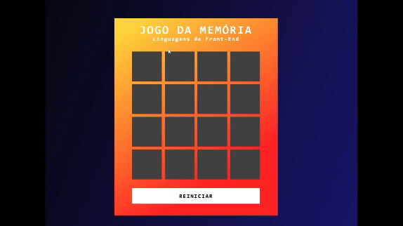

  

# Jogo da Memória em JavaScript

Teste sua memória identificando e combinando as tecnologias mais populares no desenvolvimento Front-End!

No desenvolvimento desse jogo pude aplicar os conhecimentos em manipulação de DOM através do JavaScript, além da implementação de recursos multimídia, como efeitos sonoros, elementos personalizados e animações.

## Tecnologias Utilizadas:

## Funcionalidades:

- Animação de cards com frente e verso;
- Botão para reiniciar o jogo;
- Efeitos sonoros ao virar os cards;
- Pop-up de alerta personalizado ao finalizar o jogo.

## Aprendizados com esse projeto:

1. Manipulação de DOM com JavaScript
2. Transições e efeitos de transformação com CSS
3. Implementação multimídia

## Como jogar:

Para jogar basta clicar <a href="#">AQUI</a>!

## A ser implementado:

1. Histórico de jogadas realizadas e vitórias
2. Responsividade
3. Novas opções de baralhos

### Créditos:
---

Este jogo foi desenvolvido como parte de um projeto educacional da Digital Innovation One (DIO).

##

Feito por <a href="https://github.com/juniord-dev">Junior Dantas</a>.
